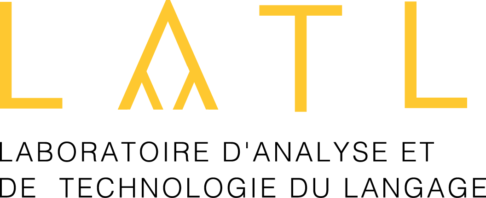

    

# Redesign of the LATL site

Update of the **Language Analysis and Technology Laboratory** site with the **CMS Concrete5**.

This project was done as part of the course New information and communication technology (NTIC).

## Technologies used

This site was done with php, html, css and js.

Others technologies was used like **bootstrap** for the layout and **concrete5** for the management of the pages.

### Bootstrap Inspiration

http://russmaxdesign.github.io/02-bootstrap-kickoff-template-image/

### Concrete5

https://www.concrete5.org/
